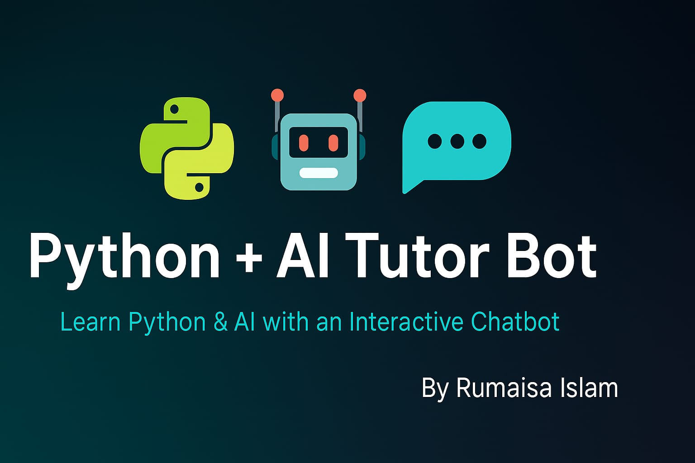

<!-- Banner -->
<p align="center">
  
</p>

# 🤖 Python + AI Tutor Bot

A chatbot-powered web application built using **Flask + OpenAI + SQLite** that helps users learn Python programming and AI concepts through an interactive, menu-driven interface.

---

## 🚀 Features

- 🔐 User Registration & Login with Flask-Login  
- 🐍 Python Basics Learning (Variables, Loops, Functions, etc.)  
- ⚙️ Advanced Python Concepts (List Comprehensions, Generators, Decorators)  
- 🤖 AI Concepts Explained (AI, ML, Chatbots)  
- 🎲 Random Python Questions  
- 💬 Chat Interface with Session Handling  
- 🧪 Pytest-based Route Testing

---

## 🛠️ Tech Stack

| Layer       | Technology                |
|-------------|---------------------------|
| Backend     | Python, Flask             |
| Frontend    | HTML, CSS (custom)        |
| Database    | SQLite + SQLAlchemy ORM   |
| Auth        | Flask-Login               |
| AI Engine   | OpenAI API                |
| Testing     | Pytest                    |

---

## 🧪 Testing with Pytest

This project includes a basic `test/` folder that checks core routes using `pytest`.

To run tests:

```bash
pip install -r requirements.txt
pytest
```

✅ Example checks:

* Redirects unauthenticated user to login
* Ensures login page loads properly

---

## 📁 Project Structure

```
.
├── app.py
├── forms.py
├── models.py
├── templates/
│   ├── base.html
│   ├── chat.html
│   ├── login.html
│   └── register.html
├── static/
│   └── style.css
├── test/
│   └── test_basic_routes.py
├── requirements.txt
├── banner.png
└── README.md
```

---

## 📌 Getting Started

### 1. Clone the Repo

```bash
git clone https://github.com/Rumaisas-islam/ai-python-tutor-bot.git
cd ai-python-tutor-bot
```

### 2. Create Virtual Environment

```bash
python -m venv venv
source venv/bin/activate   # Windows: venv\Scripts\activate
```

### 3. Install Requirements

```bash
pip install -r requirements.txt
```

### 4. Set Environment Variable

Create a `.env` file in root:

```
OPENAI_API_KEY=your-api-key-here
```

---

## ✅ Badges


---

## 📃 License

This project is licensed under the MIT License. See the [LICENSE](LICENSE) file for details.

---

> 🌟 Don’t forget to star this project if it helped you!
